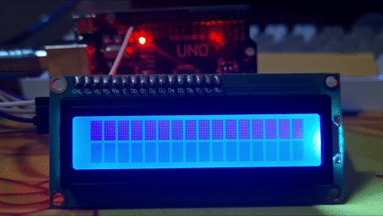
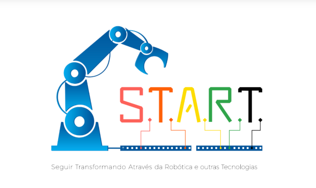

```cpp
void setup() {

```
<div align="center">



</div>

---

## About Me

- Computer Science student at the <a href="https://www.ifg.edu.br/anapolis">Federal Institute of Anápolis</a> MEC Rating: 5

- Arduino and microcontroller enthusiast

-  Interested in software development, embeded systems and low-level programming

- Experience developing educational and hardware projects as a monitor in the Seguir Transformando Através da Robótica e outras Tecnologias (START) Program  
  <a href="LINK_DO_SITE_DO_START">
    
  </a>

- Focused on embedded systems

---

## Technologies

<div align="center">


</div>

```cpp
}
```
---
```cpp
void loop() {

```

- Currently leraning ESP32 development and embedded systems 

---

## Contact With Me

<div align="center">

<a href="mailto:isaque711.nascimento@gmail.com">
  
</a>

</div>

```cpp
}
```
